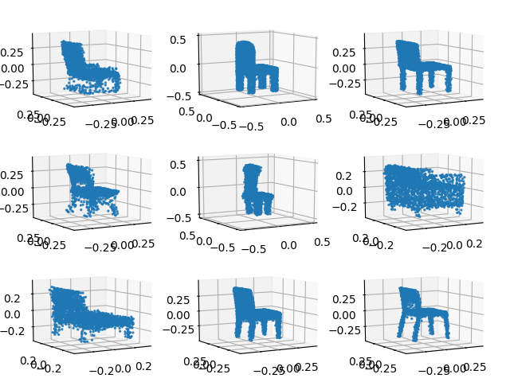

# pcae
Point Cloud Gaussian Mixture Models and Shape Completion with Auto-encoder embeddings

Adapted from [latent_3d_points](https://github.com/optas/latent_3d_points) with PyTorch 1.0. Use pytorch [Chamfer distance](https://gist.github.com/WangZixuan/4c4cdf49ce9989175e94524afc946726) and Generative GMM for shape completion. 

# Samples

# Original -> Partial -> Completed
 
 

